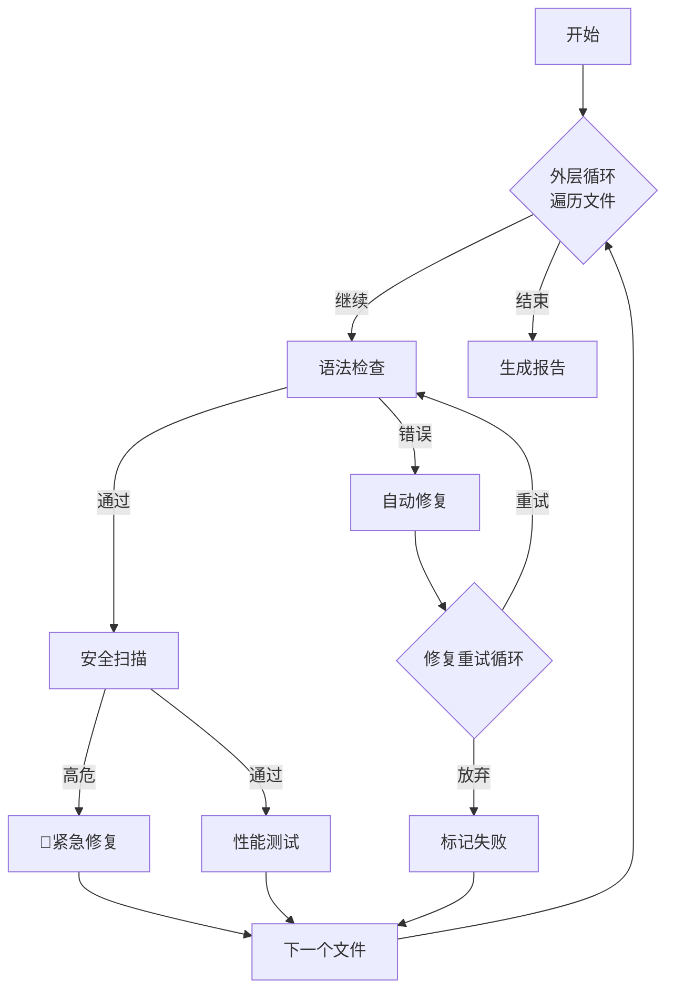

User: 如果我们的流程更像是程序中的流程图, 有很多个循环/分支判断呢, 是否也有优雅实现方式
Kimi: 针对**类程序流程图（复杂控制流：嵌套循环、分支跳转、子流程调用）**的场景，推荐采用**"程序计数器（PC）+ 调用栈（Call Stack）"**的架构来模拟真实的程序执行。这是处理复杂控制流最优雅的方式。

以下是完整的工业级实现方案：

## 核心架构：虚拟机的控制流模型

```python
from typing import TypedDict, List, Dict, Optional, Literal, Any, Callable
from langgraph.graph import StateGraph, END, START
from langgraph.types import Command, Interrupt
from dataclasses import dataclass, field
from enum import Enum, auto
import time
from contextlib import contextmanager

class OpCode(Enum):
    """流程图操作码"""
    SEQ = auto()      # 顺序执行
    IF = auto()       # 条件分支
    LOOP = auto()     # 循环开始
    BREAK = auto()    # 跳出循环
    CONTINUE = auto() # 继续循环
    CALL = auto()     # 子流程调用
    RETURN = auto()   # 子流程返回

@dataclass
class StackFrame:
    """调用栈帧，支持子流程和循环嵌套"""
    function_name: str
    pc: int = 0                    # 程序计数器
    loop_counter: int = 0          # 当前循环迭代次数
    max_iterations: int = 10       # 防止无限循环
    locals: Dict = field(default_factory=dict)  # 局部变量

@dataclass 
class FlowNode:
    """流程图节点定义"""
    id: str
    opcode: OpCode
    description: str
    action: Callable
    next_id: Optional[str] = None           # 顺序下一个
    branches: Dict[str, str] = field(default_factory=dict)  # 分支跳转表
    weight: float = 1.0                      # 进度权重
    
    def __post_init__(self):
        if self.opcode == OpCode.LOOP and not self.branches.get('body'):
            raise ValueError("LOOP节点必须定义body分支")

class ProgramFlowState(TypedDict):
    # 虚拟机核心状态
    stack: List[StackFrame]                  # 调用栈
    global_vars: Dict                        # 全局变量
    
    # 执行追踪
    execution_log: List[Dict]                # 执行轨迹（用于回放）
    current_location: str                    # 当前位置 "function:pc"
    
    # 进度计算（考虑嵌套和循环）
    base_progress: float                     # 基础进度
    loop_multipliers: Dict[str, float]       # 循环进度系数
    
    # 用户反馈
    status: Literal["running", "paused", "completed", "error"]
    message: str                             # 当前状态描述
    detail: Dict                             # 详细上下文
```

## 完整的流程图执行引擎

```python
class ProgramFlowEngine:
    """类程序流程图执行引擎"""
    
    def __init__(self):
        self.nodes: Dict[str, FlowNode] = {}
        self.subgraphs: Dict[str, 'ProgramFlowEngine'] = {}  # 子流程
        self.call_graph = {}  # 调用关系图
        
    def register_node(self, node: FlowNode):
        """注册流程节点"""
        self.nodes[node.id] = node
        return self
    
    def register_subgraph(self, name: str, subgraph: 'ProgramFlowEngine'):
        """注册子流程（支持嵌套）"""
        self.subgraphs[name] = subgraph
        return self
    
    def build(self):
        """构建可执行的LangGraph"""
        builder = StateGraph(ProgramFlowState)
        
        # 使用单一的"CPU"节点执行当前PC指向的指令
        # 这是模拟程序执行的关键：不直接映射图为节点，而是映射为指令序列
        builder.add_node("cpu", self._cpu_cycle)
        builder.add_node("interrupt_handler", self._handle_interrupt)
        
        builder.set_entry_point("cpu")
        
        # CPU自循环，直到遇到END
        builder.add_conditional_edges(
            "cpu",
            self._should_continue,
            {"continue": "cpu", "end": END, "interrupt": "interrupt_handler"}
        )
        
        # 中断处理后可继续
        builder.add_edge("interrupt_handler", "cpu")
        
        return builder.compile()
    
    def _cpu_cycle(self, state: ProgramFlowState):
        """执行一个CPU周期（取指-译码-执行）"""
        frame = state["stack"][-1]
        current_func = frame.function_name
        
        # 获取当前指令
        node_id = self._resolve_pc(current_func, frame.pc)
        if not node_id or node_id not in self.nodes:
            return Command(goto=END)
        
        node = self.nodes[node_id]
        state["current_location"] = f"{current_func}:{frame.pc}({node.id})"
        
        # 记录执行日志
        log_entry = {
            "timestamp": time.time(),
            "location": state["current_location"],
            "opcode": node.opcode.name,
            "description": node.description,
            "loop_count": frame.loop_counter if node.opcode == OpCode.LOOP else 0
        }
        state["execution_log"].append(log_entry)
        
        # 执行操作并捕获进度
        with self._progress_context(state, node):
            result = node.action(state)
        
        # 控制流处理（模拟CPU跳转）
        next_pc = self._calculate_next_pc(state, node, result)
        
        if isinstance(next_pc, Command):
            return next_pc
        elif next_pc == "END":
            return Command(goto=END)
        else:
            frame.pc = next_pc
            return Command(goto="cpu")
    
    def _calculate_next_pc(self, state, node, result) -> Any:
        """计算下一条指令位置（控制流逻辑）"""
        frame = state["stack"][-1]
        
        if node.opcode == OpCode.SEQ:
            return frame.pc + 1
            
        elif node.opcode == OpCode.IF:
            condition = result.get("condition", False)
            branch = "true" if condition else "false"
            target = node.branches.get(branch)
            return self._resolve_label(frame.function_name, target)
            
        elif node.opcode == OpCode.LOOP:
            frame.loop_counter += 1
            if frame.loop_counter > frame.max_iterations:
                raise RuntimeError(f"循环超出最大迭代次数: {node.id}")
            
            # 检查循环条件
            should_continue = result.get("continue", False)
            if should_continue:
                target = node.branches.get("body")
                return self._resolve_label(frame.function_name, target)
            else:
                frame.loop_counter = 0
                return frame.pc + 1
                
        elif node.opcode == OpCode.BREAK:
            # 跳出当前循环，找到最近的LOOP的结束位置
            return self._find_loop_end(state, frame.function_name)
            
        elif node.opcode == OpCode.CALL:
            # 压栈，进入子流程
            subfunc = result.get("target")
            if subfunc in self.subgraphs:
                new_frame = StackFrame(function_name=subfunc)
                state["stack"].append(new_frame)
                return 0  # 从子流程开头开始
            else:
                raise ValueError(f"未定义的子流程: {subfunc}")
                
        elif node.opcode == OpCode.RETURN:
            # 出栈，返回调用者
            if len(state["stack"]) > 1:
                state["stack"].pop()
                return frame.pc + 1  # 返回调用者下一条
            else:
                return "END"
        
        return frame.pc + 1
    
    @contextmanager
    def _progress_context(self, state, node: FlowNode):
        """进度追踪的上下文管理器"""
        start_time = time.time()
        
        # 计算进度（考虑嵌套深度和循环）
        depth = len(state["stack"])
        progress = self._calculate_progress(state, node)
        
        # 构建状态消息
        if node.opcode == OpCode.LOOP:
            frame = state["stack"][-1]
            msg = f"🔄 循环 [{node.id}] 第 {frame.loop_counter} 次迭代: {node.description}"
        elif node.opcode == OpCode.IF:
            msg = f"🔀 分支判断 [{node.id}]: {node.description}"
        elif node.opcode == OpCode.CALL:
            msg = f"📞 调用子流程 [{node.id}]: {node.description}"
        else:
            msg = f"▶️ 执行 [{node.id}]: {node.description}"
        
        state["message"] = msg
        state["detail"] = {
            "node_id": node.id,
            "opcode": node.opcode.name,
            "depth": depth,
            "progress": progress,
            "timestamp": start_time
        }
        
        yield
        
        # 记录耗时
        duration = time.time() - start_time
        state["detail"]["duration"] = duration
    
    def _calculate_progress(self, state, current_node) -> float:
        """智能进度计算（处理嵌套循环）"""
        total_weight = sum(n.weight for n in self.nodes.values())
        completed = 0
        
        # 简单版本：基于调用栈深度的加权计算
        for i, frame in enumerate(state["stack"]):
            factor = 0.5 ** i  # 每深一层，权重减半
            completed += frame.pc * factor
            
            # 如果是循环，根据迭代次数调整
            if frame.loop_counter > 0:
                completed += (frame.loop_counter * 0.1) * current_node.weight
        
        return min(95, (completed / total_weight) * 100)
    
    def _resolve_pc(self, func_name: str, pc: int) -> Optional[str]:
        # 简化的PC解析，实际应维护指令表
        pass
    
    def _resolve_label(self, func_name: str, label: str) -> int:
        # 标签解析为PC
        pass
    
    def _find_loop_end(self, state, func_name: str) -> int:
        # 查找循环结束位置
        pass
    
    def _should_continue(self, state):
        if state["status"] == "error":
            return "end"
        if state["status"] == "paused":
            return "interrupt"
        return "continue"

# ========== 业务层：定义具体的代码审查流程 ==========

def create_code_review_flow():
    """创建一个复杂的代码审查流程（带嵌套循环和分支）"""
    engine = ProgramFlowEngine()
    
    # 定义变量
    files_to_check = []
    current_file_idx = 0
    errors_found = []
    
    # 节点1: 初始化（SEQ）
    def init_action(state):
        state["global_vars"]["files"] = ["user.py", "auth.py", "db.py"]
        state["global_vars"]["idx"] = 0
        state["global_vars"]["report"] = []
        return {}
    
    engine.register_node(FlowNode(
        id="init", opcode=OpCode.SEQ, 
        description="初始化文件列表",
        action=init_action, next_id="outer_loop"
    ))
    
    # 节点2: 外层循环 - 遍历文件（LOOP）
    def outer_loop_action(state):
        idx = state["global_vars"]["idx"]
        files = state["global_vars"]["files"]
        should_continue = idx < len(files)
        
        if should_continue:
            state["global_vars"]["current_file"] = files[idx]
            state["message"] = f"开始检查文件 {files[idx]} ({idx+1}/{len(files)})"
        return {"continue": should_continue}
    
    engine.register_node(FlowNode(
        id="outer_loop", opcode=OpCode.LOOP,
        description="遍历所有文件",
        action=outer_loop_action,
        branches={"body": "syntax_check"}
    ))
    
    # 节点3: 语法检查（IF）
    def syntax_check_action(state):
        file = state["global_vars"]["current_file"]
        # 模拟检查
        has_error = file == "auth.py"  # 模拟auth.py有错误
        state["global_vars"]["has_syntax_error"] = has_error
        return {"condition": has_error}
    
    engine.register_node(FlowNode(
        id="syntax_check", opcode=OpCode.IF,
        description=f"检查语法",
        action=syntax_check_action,
        branches={"true": "auto_fix", "false": "security_scan"}
    ))
    
    # 节点4: 自动修复（子流程CALL）
    def auto_fix_action(state):
        # 实际这里会调用子流程
        state["message"] = f"🛠️ 自动修复 {state['global_vars']['current_file']}..."
        return {"target": "fix_subgraph"}
    
    engine.register_node(FlowNode(
        id="auto_fix", opcode=OpCode.CALL,
        description="调用修复子流程",
        action=auto_fix_action
    ))
    
    # 修复子流程（嵌套图）
    fix_engine = ProgramFlowEngine()
    fix_engine.register_node(FlowNode(
        id="fix_step1", opcode=OpCode.SEQ,
        description="分析错误类型",
        action=lambda s: {"error_type": "import"}
    ))
    fix_engine.register_node(FlowNode(
        id="fix_step2", opcode=OpCode.SEQ,
        description="应用修复模板",
        action=lambda s: {"fixed": True}
    ))
    engine.register_subgraph("fix_subgraph", fix_engine)
    
    # 节点5: 内层循环 - 修复重试（LOOP）
    def fix_retry_action(state):
        attempts = state["global_vars"].get("fix_attempts", 0)
        state["global_vars"]["fix_attempts"] = attempts + 1
        # 最多重试3次
        return {"continue": attempts < 3 and state["global_vars"].get("has_syntax_error", False)}
    
    engine.register_node(FlowNode(
        id="fix_retry", opcode=OpCode.LOOP,
        description="修复重试循环",
        action=fix_retry_action,
        branches={"body": "syntax_check"}  # 修复后重新检查
    ))
    
    # 节点6: 安全扫描（SEQ）
    def security_scan_action(state):
        file = state["global_vars"]["current_file"]
        # 模拟发现高危漏洞
        if file == "db.py":
            state["global_vars"]["critical_issue"] = True
            return {"goto": "emergency_fix"}  # 特殊跳转
        return {}
    
    engine.register_node(FlowNode(
        id="security_scan", opcode=OpCode.SEQ,
        description="安全漏洞扫描",
        action=security_scan_action, next_id="performance_check"
    ))
    
    # 节点7: 紧急修复（BREAK特殊情况）
    def emergency_action(state):
        state["global_vars"]["report"].append({
            "file": state["global_vars"]["current_file"],
            "status": "EMERGENCY_FIX_REQUIRED"
        })
        return {}
    
    engine.register_node(FlowNode(
        id="emergency_fix", opcode=OpCode.SEQ,
        description="🚨 紧急修复高危漏洞",
        action=emergency_action, next_id="next_file"
    ))
    
    # 节点8: 性能检查（SEQ）
    def perf_check_action(state):
        return {"score": 95}
    
    engine.register_node(FlowNode(
        id="performance_check", opcode=OpCode.SEQ,
        description="性能测试",
        action=perf_check_action, next_id="next_file"
    ))
    
    # 节点9: 文件索引递增（SEQ）
    def next_file_action(state):
        state["global_vars"]["idx"] += 1
        state["global_vars"]["fix_attempts"] = 0  # 重置重试计数
        return {}
    
    engine.register_node(FlowNode(
        id="next_file", opcode=OpCode.SEQ,
        description="处理下一个文件",
        action=next_file_action, next_id="outer_loop"  # 回到循环头部
    ))
    
    return engine

# ========== 运行与监控 ==========

async def run_with_monitoring():
    engine = create_code_review_flow()
    graph = engine.build()
    
    initial_state = {
        "stack": [StackFrame(function_name="main", pc=0)],
        "global_vars": {},
        "execution_log": [],
        "current_location": "main:0",
        "base_progress": 0,
        "loop_multipliers": {},
        "status": "running",
        "message": "启动...",
        "detail": {}
    }
    
    print("🚀 启动复杂流程图执行（支持嵌套循环/分支/子流程）\n")
    
    # 使用stream监控每一步
    async for event in graph.astream(initial_state, stream_mode="values"):
        msg = event.get("message", "")
        detail = event.get("detail", {})
        loc = event.get("current_location", "")
        
        # 格式化输出
        depth = len(event.get("stack", []))
        indent = "  " * depth
        progress = detail.get("progress", 0)
        
        print(f"[{progress:5.1f}%] {indent}{msg}")
        print(f"       位置: {loc} | 深度: {depth}")
        
        if "duration" in detail:
            print(f"       耗时: {detail['duration']:.2f}s")
        print()

if __name__ == "__main__":
    import asyncio
    asyncio.run(run_with_monitoring())
```

## 关键创新点

### 1. **PC（程序计数器）模型**
不同于DAG的节点跳转，这里使用**指令指针**方式：
- 每个节点是"指令"而非"状态"
- 支持任意复杂的`GOTO`（通过修改PC）
- 天然支持循环（修改PC回退）

### 2. **调用栈（Call Stack）**
```python
state["stack"] = [
    StackFrame("main", pc=3, loop_counter=2),      # 主流程：第2次外层循环
    StackFrame("fix_subgraph", pc=1, loop_counter=0)  # 子流程：修复中
]
```
- 支持子流程嵌套
- 支持递归调用
- 支持`break`跳出多层（弹栈）

### 3. **流式进度语义**
```python
# 嵌套循环进度显示示例：
[35.0%]   🔄 循环 [outer_loop] 第 2 次迭代: 遍历所有文件
       位置: main:2(outer_loop) | 深度: 1

[42.0%]     🛠️ 自动修复 auth.py...
       位置: main:4(auto_fix) | 深度: 1

[45.0%]       📞 调用子流程 [fix_subgraph]: 调用修复子流程
       位置: main:4->fix_subgraph:0 | 深度: 2

[48.0%]         ▶️ 执行 [fix_step1]: 分析错误类型
       位置: fix_subgraph:0 | 深度: 2
```

### 4. **中断与单步执行**
```python
# 在任意节点插入断点
def breakpoint_action(state):
    state["status"] = "paused"
    return Interrupt({
        "type": "breakpoint",
        "vars": state["global_vars"],
        "stack": state["stack"]
    })

# 支持单步、继续、跳过等调试操作
```

## 可视化映射

这种结构可以完美映射到真实的程序流程图：



这套方案的优势在于：
1. **表达能力强**：可实现任意复杂控制流（while/for/break/continue/try-catch）
2. **进度精确**：通过PC和调用栈计算真实执行进度，而非节点访问计数
3. **可调试性**：支持断点、单步执行、变量查看
4. **可视化友好**：执行轨迹可直接映射为流程图高亮

这是将LangGraph用作**流程虚拟机（Flow VM）**的高级模式，适合替代传统的BPMN引擎或工作流引擎。
